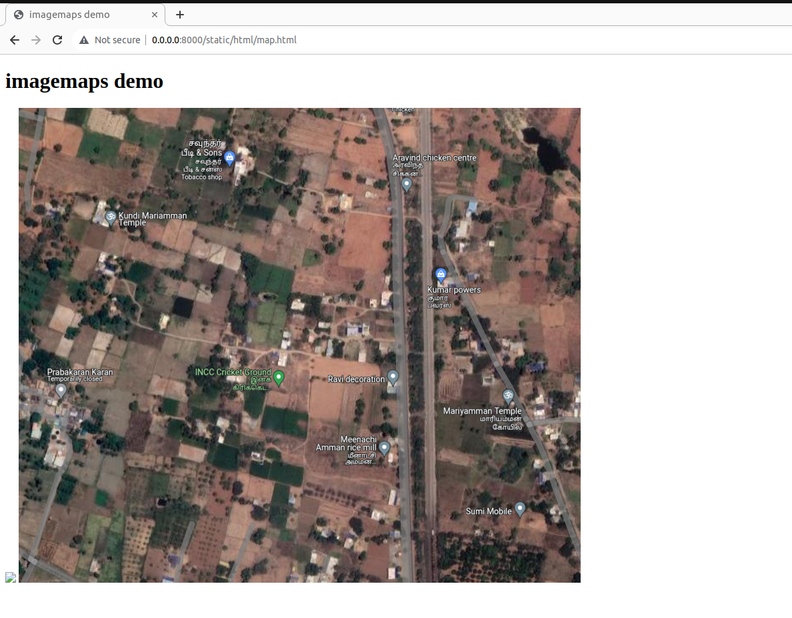
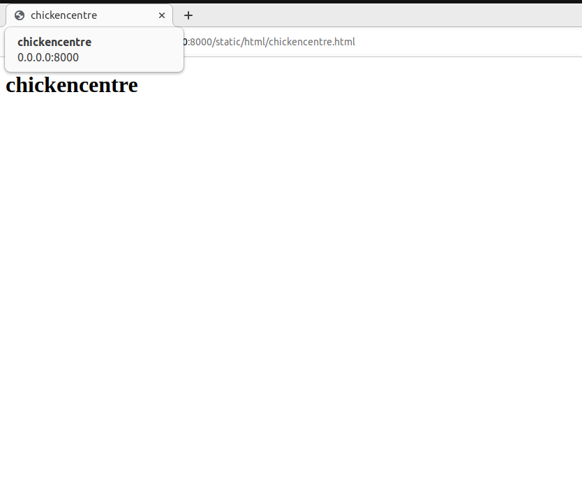
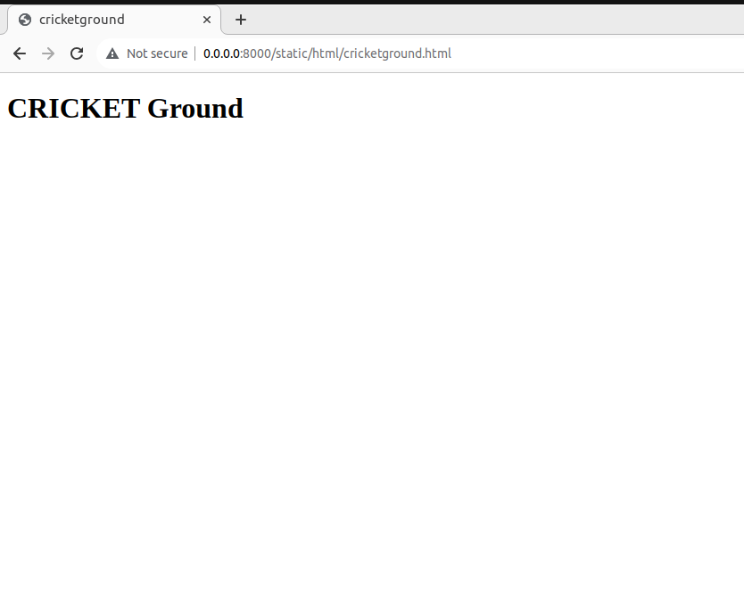
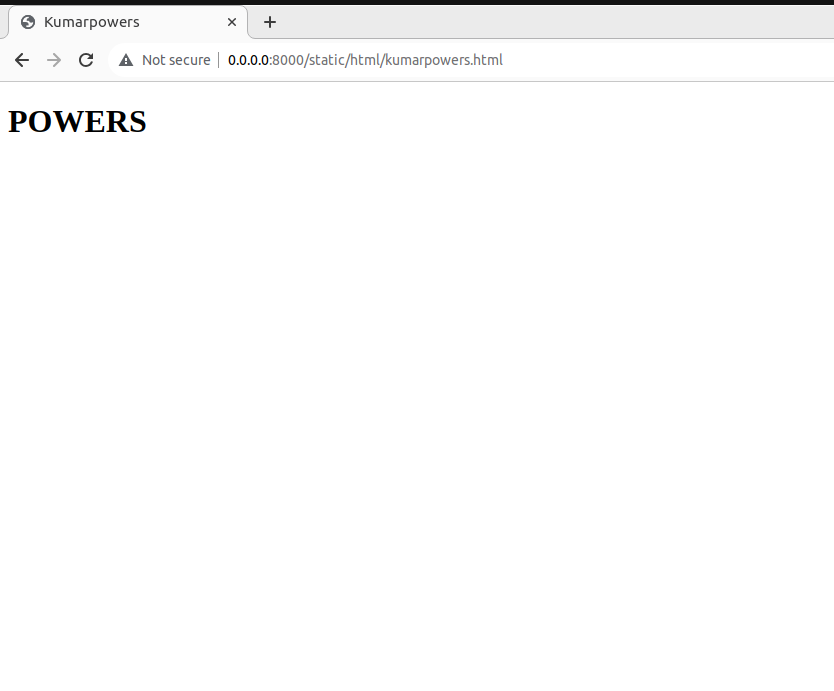
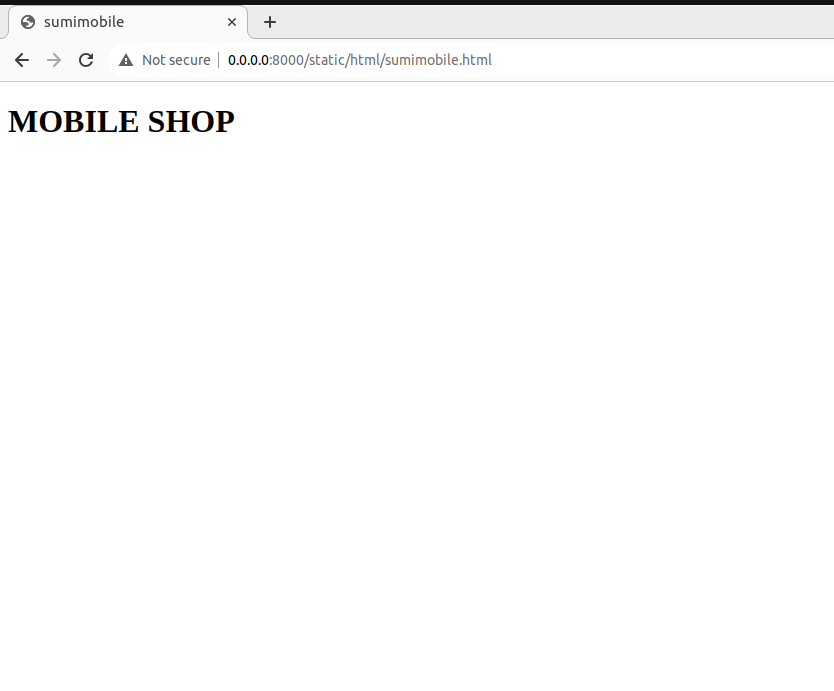
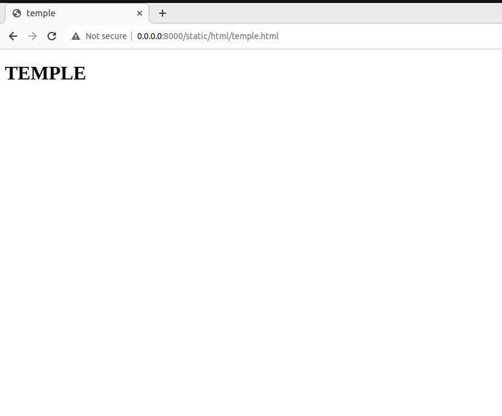

# Places Around Me
## AIM:
To develop a website to display details about the places around my house.

## Design Steps:

### Step 1:
Clone the github repository into the IDE
### Step 2:
Create a django project
### Step 3:
Write the needed HTML code
### Step 4:
Run the django server and excute the HTML files

## Code:
map.html code:
```html
<!DOCTYPE html>
<html>
    <head>
        <title>
            imagemaps demo
        </title>
    </head>
    <body>
        <h1> imagemaps demo</h1>
        
        
<map name="image_map">
  <area alt="chickencentre" title="chickencentre" href="chickencentre" coords="584,97,36" shape="circle">
  <area alt="kumarpowers" title="kumarpowers" href="kumarpowers" coords="645,270,53" shape="circle">
  <area alt="temple" title="temple" href="temple" coords="636,439,764,497" shape="rect">
  <area alt="cricketground" title="cricketground" href="cricketground" coords="258,383,408,439" shape="rect">
  <area alt="sumitemple" title="sumitemple" href="sumitemple" coords="668,596,769,631" shape="rect">
</map>

    </body>
</html>
```
chicken centre code:
```html


<!DOCTYPE html>
<html>
<head>
    <title>chickencentre</title>
</head>
<body>
    <h1>chickencentre</h1>
</body>
</html>
```
Cricket ground:
```html
<!DOCTYPE html>
<html>
<head>
    <title>cricketground</title>
</head>
<body>
    <h1>CRICKET Ground</h1> 
</body>
</html>
```
kumarpowers code:
```html
<!DOCTYPE html>
<html>
<head>
    <title>Kumarpowers</title>
</head>
<body>
    <h1>POWERS</h1>
</body>
</html>

```
SumiMobiles Code:
```html
<!DOCTYPE html>
<html>
<head>
    <title>sumimobile</title>
</head>
<body>
    <h1>MOBILE SHOP</h1>
</body>
</html>
 
```
Temple Code:
```html
<!DOCTYPE html>
<html>
<head>
    <title>temple</title>
</head>
<body>
    <h1>TEMPLE</h1>
</body>
</html>

```
## Output:

Chicken Centre output


Cricket Output 


KumarPower Output


SumiMobile Output


Temple Output 


## Result:
Finally this programm was successfully executed.